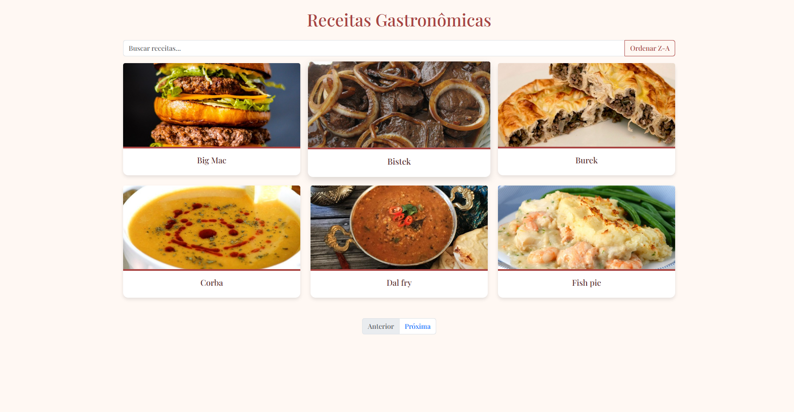
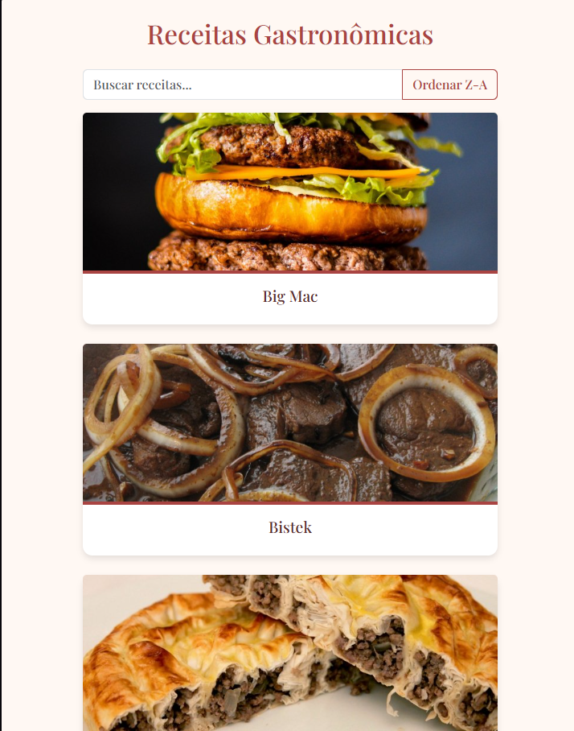

# 🍽️ Receitas Gastronômicas

Frontend Angular que usa a [API TheMealDB](https://www.themealdb.com/) para exibir receitas. Tem busca, ordenação alfabética, paginação e clicando em alguma receita, te leva para a página dos detalhes da mesma.

---

## Site rodando

---

## Funcionalidades

- Busca por nome da receita
- Ordenação alfabética
- Paginação de dezenas de receitas
- Página de detalhes com ingredientes e modo de preparo
- Responsivo (mobile-first) com Bootstrap

---

## Tecnologias utilizadas

- [Angular](https://angular.io/)
- [Bootstrap](https://getbootstrap.com/)
- [TheMealDB API](https://www.themealdb.com/)
- HTML + CSS + TypeScript

---

## Instalação

  # Clone o rep

  git clone https://github.com/Lorenzette/receitas-gastronomicas.git

  # Acesse a pasta

  cd receitas-gastronomicas

  # Instale as dependências

  npm install

  # Inicie

  ng serve
